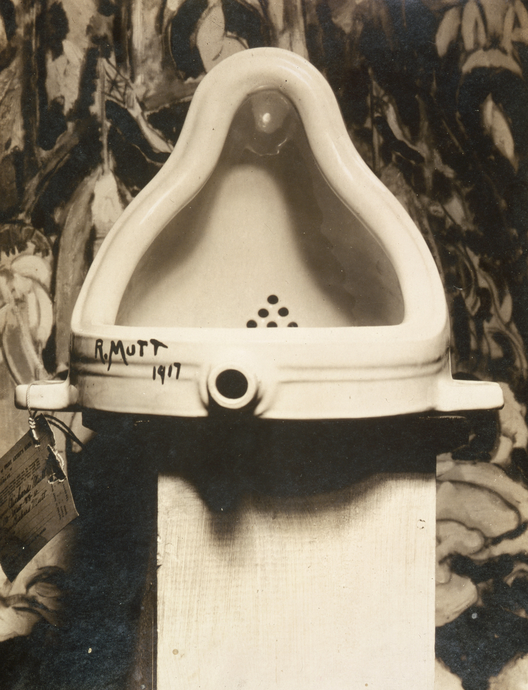
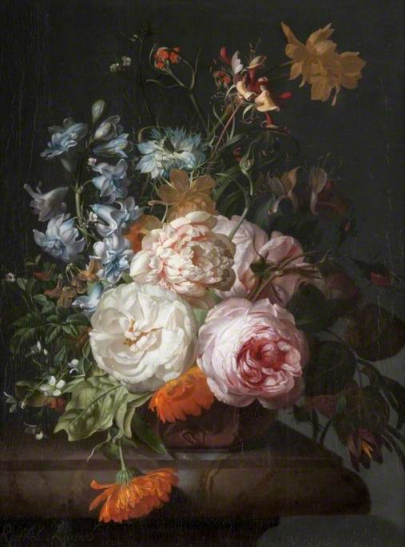

  <a href="https://open.substack.com/pub/swafan/p/is-ai-art-art-and-other-uninteresting?utm_campaign=post-expanded-share&utm_medium=web" target="_blank" rel="noopener noreferrer" class="writing-md-external-btn">read on substack</a>

*Is AI art art?*
Short answer: Yes, it’s just not very good.

*Is AI art theft?*
Short answer: The theft question is a semantic (legal) question about how we define “copyright.” Are artists harmed? Yes.

*Does AI spell the death of the (“traditional”) artist and other art forms?*
Short answer: No. It’s probably more alive than ever (sort of).

*How do artists “move forward” in the age of AI?*
Short answer: As they always do.

---

“This is the end of art. I am glad I have had my day.” J.M.W. Turner, 1839/40.[^1]

“Nevertheless, it is obvious that this industry, by invading the territories of art, has become art’s most mortal enemy...” Charles Baudelaire, 1859.[^2]

Those quotes were about photography. One hundred and eighty-seven years later, we ask: “Has art ended again?”[^3]

---

In 2016, a student left his glasses on the floor of the SFMOMA as a prank. Crowds swarmed the glasses. Many took photos. A few news outlets reported this. Memes circulated.[^4] The general consensus was “modern art is b\*llsht.”

(Firstly, it’s *contemporary* art, not modern art.)

But what’s the assumption here? The assumption is that non-art (glasses) was treated by art buffs as if it were “high” art.

I find that assumption wrong. The pair of glasses *was* art. There were even artists with an intention to create art. The intentions might be cynical, to f\*ck with art society, or to experiment and see what this would create; but it’s not uncommon (even within art circles) to be cynical about the pretension of art institutions and their associated friends. There were also artistic decisions: the choice to use glasses, not coins. Or shoes. Now, I don’t think that was *good* art, but it was art nonetheless.

Let’s consider, properly, the art object (glasses) itself. Already, it is in a lineage or conversation with the readymade. Marcel Duchamp, all the way back in 1914, began experimenting with (al-)ready(-)made objects, choosing ordinary manufactured objects like drying racks or shovels or urinals and placing them in the context of a gallery. While many brighter than I have dedicated their entire lives to Duchamp, I’ll just note that this gestures to irony, to humor, to the art institution, to *what counts as art*, to expression, to mechanical reproduction, to a particular anti-rationalist attitude during the interwar years, to taste, and an infinite number of other things. I know someone with an R. MUTT tattoo.

<figure>
  
  <figcaption class="writing-img-caption">Marcel Duchamp, Fountain, 1917. Photography by Alfred Stieglitz, taken at 291 (Art Gallery), New York following the 1917 Society of Independent Artists exhibition. Backdrop painting: The Warriors by Marsden Hartley. Public domain. Source: Wikimedia Commons.
</figcaption>
</figure>

---

I took a few electives in art history during college.

Before I took them, I had thought the most important questions were “what is art” and “is *x* art?” I was told to briefly withhold those questions and instead prod works I do not understand with: "*as an art object*, what does this say?”

The questions I had dissolved shortly after that.

It seems to me that we can treat *all* things as art objects. We can understand everything in terms of the aesthetic experience. And if you have that inclination as well, the cynicism disappears. We can look at something mundane, something not intended to be “high” art and ask: what does this say?

For, like any high school English student can tell you, the meaning of a work is not merely contained in the intentions of its author. Consider, say, *Pride and Prejudice*. Its “meaning(s)” has to do not only with what Jane Austen intended, but its enduring popularity, the ire of 21st century English class students, later works that used similar tropes, the 2005 movie featuring Keira Knightley, *Pride and Prejudice and Zombies*, as well as an infinite number of things that came before and after and even after us.

So who’s to say a Midjourney image is not a proper art object? Who’s to say Midjourney itself is not a proper art object?

---

A related question: why are some ancient artifacts in the art museum and some other ancient artifacts in the history museum?

It seems to me why I think the glasses prank is not particularly exciting art for me is because it’s sort of self-defeating. If the intention is (and again, intention is not all) in part to undermine the credibility of art institutions, it functions insofar as saying something like “this thing that is not art is being treated as art.” But we are already re-using that label “art” to delineate between certain works and certain other works. In its very critique of art institutions, it reuses the label that benefits them.

The answer: some ancient artifacts belong in the art museum and some other artifacts belong in the history museum.

---

The second uninteresting question is whether AI art is theft.[^5]

Consider the Ghibli art trend in early 2025. (My favorites are *Princess Mononoke* and *Kiki’s Delivery Service*.) Some folks on the internet were upset.[^6] There was a sense that this was hurting the creative legacy of Miyazaki-san.

That AI-generated art can hurt artists is simply true. Inasmuch as they replicate distinct styles for circulation and inasmuch as corporations ditch the services of artists for cheaper, AI-generated work, AI art hurts artists.

But that’s not the question. The question is: “Is AI art theft?”

Whether it is or not depends on how we define theft.

Consider the diffusion model. It works by generating random noise before using unimaginable amounts of data to iteratively predict and subtract noise until it outputs an image. It does not copy any *singular* work, even if the output imitates a style. And “style” is not protected under copyright, an explicit argument in the *Andersen v. Stability AI* class-action case.[^7] But this line or argument is also stranger in a deeper way. All art is derivative. Mark Twain himself famously argued against the existence of “new ideas”: it’s “simply [taking] a lot of old ideas and [putting] them into a sort of mental kaleidoscope.”[^8]

How is this different?

A different vein of argument relates to non-consensual training. But (and I’m no legal scholar/lawyer) this seems even harder to defend. Everything posted online is already subject to un-tillion algorithms. Why is this one different?

One answer might be simply: ease. The ease of AI-generated media devalues real artists. After all, why spend money and time on artists when it’s just a chat prompt away?

So it seems the debate itself is not about art but about labor and semantics. And yes, people are being hurt. Artists (especially the ones we’d want to copy from) are being hurt. And we need to figure out new words or at least update the legal definitions of words like “theft” or “copyright” to better protect people. But no, not about art.

---

Let’s return to photography.

An often-cited idea: photography pushed art away or “liberated” it from realism. While art in the latter half of the 19th century had begun to be more interested in less “realistic” modes of expression (e.g., think the impressionists), many have argued that it’s not quite clear art was always interested in realism in the first place.

<figure>
  
  <figcaption class="writing-img-caption">Rachel Ruysch, Flowers in a Terracotta Vase, 1723. Oil on canvas. Collection: Kelvingrove Art Gallery and Museum, Glasgow. Image © Glasgow Life Museums. Licensed under Creative Commons Attribution–NonCommercial–NoDerivatives (CC BY-NC-ND). Source: Art UK, 
  <a href="https://artuk.org/discover/artworks/flowers-in-a-terracotta-vase-85940" target="_blank" rel="noopener noreferrer" class="writing-md-external-btn">https://artuk.org/discover/artworks/flowers-in-a-terracotta-vase-85940</a>

</figcaption>
</figure>

Consider this Dutch Golden Age still life by Rachel Ruysch. We might, at first glance, consider it to be “realistic.” Lifelike, even. And certainly, we do know Ruysch in part by her impeccable technique. Yet, what if I told you it is no representation of reality.

Almost certainly, this bouquet of flowers has never existed. In Dutch flower studies, the blooms typically belong to different seasons and were not painted from life (the flowers cannot last that long). Instead, what you see in front of you is a constructed image, an arranged bouquet that has less to do with “reality” and more to do with price and symbolism. For instance, tulips featured prominently in these works (they were expensive and gestured/displayed the patrons’ wealth). Meanwhile, browned flowers would gesture to the shortness of life. Carnations and lilies symbolized the Virgin. White roses had to do with true love. And so on.[^9]

---

This brings me to *Painting 2.0: Expression in the Information Age*, an extremely influential exhibition held at Museum Brandhorst in 2015.

The curators write, “[f]rom the rise of television and computers to the Internet revolution, painting has assimilated precisely those cultural and technological developments that were held responsible for its presumed ‘death’.”[^10]

The motif of the death of art haunts us.

But the immediate sense is this. Painting persists. Art persists.

In fact, there was a “resurgent interest in contemporary painting in recent years [that] coincided with an explosion of new digital media and technologies.”[^11]

---

It’s interesting that I notice two almost-opposite threads.

I’m lucky enough to have met many professional classical musicians. They’re a fun bunch. But they’re a pessimistic bunch in general. They keep thinking about the death of classical music.

1%. That’s the commonly cited figure of the percentage of the public that cares about classical music.[^12]

“If only 1% becomes 2%, then all our problems would be solved.” That’s the sort of pessimism I’m talking about.

A recent conversation I had was quite telling. I was told that in 2008 and 2009, they could physically see less people at the concert hall. The conclusion seemed to be that art can only flourish when economic conditions are right.

I disagreed.

*Livelihoods* don’t flourish when the economic conditions are bad. The art is fine.

Many of the most transformative works and influential works of art occurred during periods of trauma, war, and deprivation. The Duchamp I used earlier was produced during the interwar years. Ruysch lived through the Second Anglo-Dutch War, the Franco-Dutch War, and the beginning of the end of the Dutch Golden Age.

The *art* is fine.

The people are not.

The thing is, in the age of LLM parrots and chatbots, there is another thread I see. Flip phone resurgence,[^13] angry comments under AI-generated YouTube thumbnails, a 74% rise in CD players in 2025.[^14]

I speculate.

As media proliferates in the post-digital age, we gravitate towards gravitas. Materiality. CDs. Not Spotify. Images that take weeks. Not seconds. Clicky, heavy objects. Not light glass rectangles.

Just as there was a “resurgent interest in contemporary painting” as screens began to permeate our social lives yesterday, there is a resurgent interest in effort-based, *heavy* art as AI-generated media begins to permeate our social lives today.

Effort is cool again. Earnestness is cool again. Trying hard is cool again.

This is not to say that AI art forces us to think about these concepts *moving forward*. It simply reveals what we already value.

Do people think the glasses weren’t art because not much effort went into them?

---

Ultimately, the questions I dismissed—i*s AI art art? is it theft? does it spell the death of artists? how do artists move forward?*—are uninteresting because they are not really art questions but labor questions.

But then there’s nothing much to be said. People die when they are killed.[^15] People get f\*cked when they get f\*cked. There’s no news there.

Long answer: Art *can* thrive, and *does* thrive, under terrible conditions. The artists might not.

<!-- Footnotes -->
[^1]: J.M.W. Turner, quoted in Hollis Frampton, “Digressions on the Photographic Agony,” *Artforum* 11, no. 3 (November 1972). <a href="https://www.artforum.com/features/digressions-on-the-photographic-agony-209932/#:~:text=“This%20is%20the%20end%20of,discovery%20of%20an%20imaginary%20relic." target="_blank" rel="noopener noreferrer" class="writing-md-external-btn">Link.</a>

[^2]: Charles Baudelaire, “Lettre à M. le Directeur de la Revue Française sur le Salon de 1859,” in *Revue Française*, cinquième année, tome XVII (Paris: Aux Bureaux de la Revue Française, 1859), 257–265. Quotation from p. 265. Original French; English gloss taken from Quote Investigator. Google Books full view: <a href="https://books.google.com/books?id=yt6hVLF4hkcC&q=%22mortelle+ennemie%22#v=snippet&" target="_blank" rel="noopener noreferrer" class="writing-md-external-btn">link.</a> Translation: <a href="https://quoteinvestigator.com/2022/10/16/photo-mortal/#63871402-0d5e-4a85-beaf-6481ccecfb7e" target="_blank" rel="noopener noreferrer" class="writing-md-external-btn">link.</a>

[^3]: Owen Hulatt, “Has Art Ended Again?,” *Aeon*, May 11, 2017. <a href="https://aeon.co/essays/even-if-the-story-of-art-has-died-does-art-still-live-on" target="_blank" rel="noopener noreferrer" class="writing-md-external-btn">Link.</a>

[^4]: “Glasses Left on Floor of Gallery, People Think It’s Art,” *BBC Newsbeat*, May 26, 2016. <a href="https://www.bbc.co.uk/news/newsbeat-36391761" target="_blank" rel="noopener noreferrer" class="writing-md-external-btn">Link.</a>

[^5]: Much of my thoughts in this section come from: Alexander Avila, “How Corporations Hijkacked Anti-AI Backlash,” YouTube video, May 2, 2025. <a href="https://www.youtube.com/watch?v=lRq0pESKJgg" target="_blank" rel="noopener noreferrer" class="writing-md-external-btn">Link.</a>

[^6]: Sohani Goonetillake, “Why the AI-generated ‘Studio Ghibli’ Trend is So Controversial,” *ABC News* (Australia), April 3, 2025. <a href="https://www.abc.net.au/news/2025-04-03/the-controversial-chatgpt-studio-ghibli-trend-explained/105125570?utm_campaign=abc_news_web&utm_content=link&utm_medium=content_shared&utm_source=abc_news_web" target="_blank" rel="noopener noreferrer" class="writing-md-external-btn">Link.</a>

[^7]: *Andersen v. Stability AI*, Document 52, filed April 18, 2023, pg. 19. <a href="https://admin.bakerlaw.com/wp-content/uploads/2023/09/ECF-52-Midjourney-Motion-to-Dismiss.pdf" target="_blank" rel="noopener noreferrer" class="writing-md-external-btn">Link.</a>

[^8]: Mark Twain, *Mark Twain’s Own Autobiography: The Chapters from the North American Review* (Wisconsin: University of Wisconsin Press, 2010).

[^9]: Richard Moss, “The Beauty and Symbolism of Dutch Flower Paintings,” *Museum Crush* (Culture24), October 21, 2022. <a href="https://museumcrush.org/the-beauty-and-symbolism-of-dutch-flowers-paintings-at-compton-verney/" target="_blank" rel="noopener noreferrer" class="writing-md-external-btn">Link.</a>

[^10]: Manuela Ammer, Achim Hochdörfer, and David Joselit, eds. *Painting 2.0: Expression in the Information Age* (Munich: DelMonico/Prestel, 2015).

[^11]: Ibid.

[^12]: MRC Data Reports (2020–2021) and Nielson Music Reports (2017–2019), quoted in Ted Gioia, “Six Recent Studies Show an Unexpected Increase in Classical Music Listening,” *The Honest Broker* (Substack), March 21, 2023. <a href="https://www.honest-broker.com/p/six-recent-studies-show-an-unexpected?hide_intro_popup=true" target="_blank" rel="noopener noreferrer" class="writing-md-external-btn">Link.</a>

[^13]: Max Kutner, “Young People Are Falling in Love With Old Technology,” Wall Street Journal, October 6, 2025. <a href="https://www.wsj.com/tech/personal-tech/flip-phone-digital-camera-28a118dd" target="_blank" rel="noopener noreferrer" class="writing-md-external-btn">Link.</a>

[^14]: Zoe Wood, “CDs Return to Christmas Shopping Lists as Gen Z Embrace ‘Retro Renaissance’,” *The Guardian*, Dec 23, 2025. <a href="https://www.theguardian.com/business/2025/dec/23/cd-compact-disc-christmas-shopping-lists-gen-z-embrace-retro-renaissance" target="_blank" rel="noopener noreferrer" class="writing-md-external-btn">Link.</a>

[^15]: Yūji Yamaguchi, director, *Fate/Stay Night*, episode 22, “The Result of a Wish.” Aired June 3, 2006.