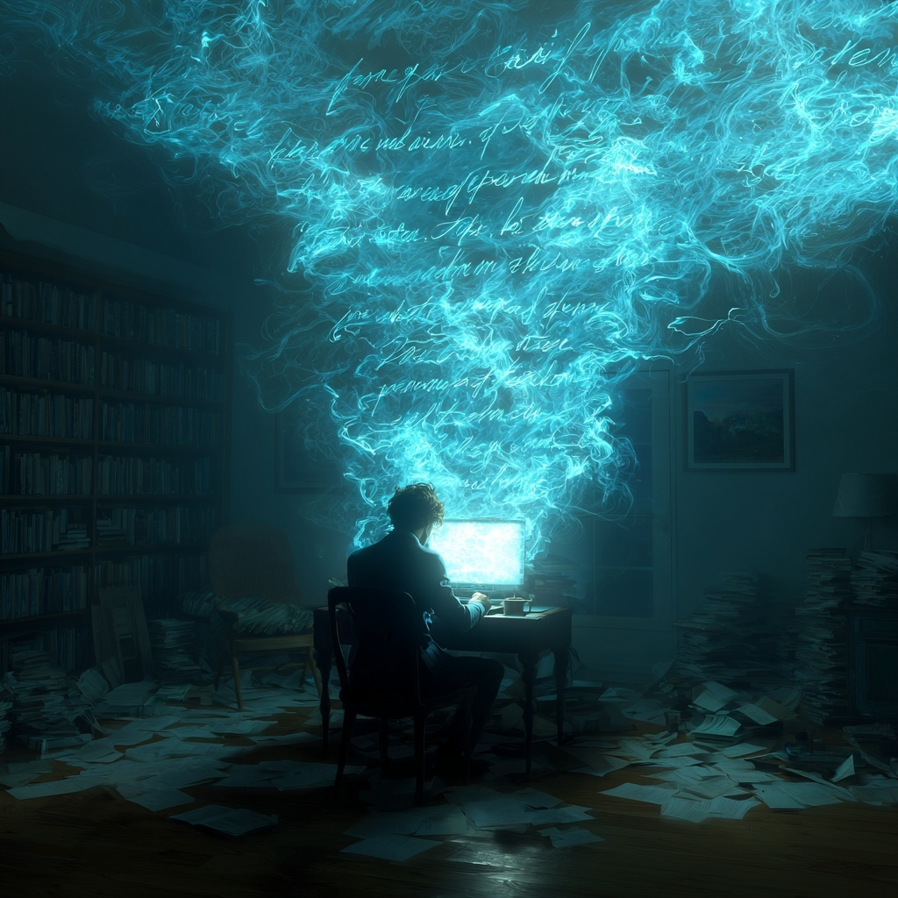

  <a href="https://open.substack.com/pub/swafan/p/this-sentence-was-not-built-for-meaning?r=1lah8p&utm_campaign=post&utm_medium=web&showWelcomeOnShare=false" target="_blank" rel="noopener noreferrer" class="writing-md-external-btn">read on substack</a>

### One: This Sentence Was Not Built for Meaning

One morning, when Gregor Samsa woke from troubled dreams, he found his unpublished manuscript transformed in his word doc into a fully-fledged—and incredible—novel. He leaned back in his chair and squinted at the foreign text. Gone was the stiff language, the over-convoluted plot. In its place: something stunning, sublime, transcendent. By the third paragraph, he was moved to tears, even if he didn’t quite understand what the words were saying.

“What’s happened?” he thought. It wasn’t a dream. His pitiful forty-page draft of half-formed fragments had become something that made *Middlemarch* look like middle school. He knew he didn’t write it—but nothing on his computer was unfamiliar. There were no tracked changes. No edit history. No new collaborators. The universe had simply… spawned this manuscript in his drive.

Gregor then sent it to a publisher. Two weeks later, he was a bestseller. He won the Pulitzer a few months after that.

No one ever asked what it means. Not even him. (And why would they? He was the second coming of Goethe.)

<figure>
  
  <figcaption class="writing-img-caption">AI-generated image (Midjourney, prompt by author).
</figcaption>
</figure>

---

But how *do* we know what Gregor’s story means? Or more abstractly, how do we know what a word means?

Philosophers of language have spent entire lifetimes on this problem and remain divided. But I’ve always thought Wittgenstein’s idea—even if no longer the consensus—at least seems intuitive.

He says that the meaning of a word is simply its use in the language. If you know how to use the word *car*—in a sentence, in conversation, in a complaint at the DMV—you’ve learned the word “car.” The meaning is in the doing.

I think about that sometimes. Especially when I remember writing essays in undergrad. I learned to use all the right words in all the right places to get all the right grades.

*Supervenience*.

*The pre-reflective cogito*.

*Being*, with a capital B.

I could put them in the correct order. I knew how to cite, to pivot, to reframe.

But I still have no idea what my essays *said*.

---

Another holy ground where meaning and symbols seem sometimes divorced: email inboxes.

When I first joined the workforce, I wrote an email like this:

>*Dear [colleague’s name],  
Thanks for the update you sent yesterday. I think your idea is quite tenable and interesting. I just have a few questions about it if you wouldn’t mind.   Firstly, while I agree that the [X] process is perhaps a bit dated, I’m not entirely sure how we can implement it given our deadline. Perhaps we should grab a chat? I was previously thinking about focusing on [X], but I’m wondering if we can combine these two approaches…*

I thought it was solid. Maybe a little too tentative, but clear. Polite. I had read the proposal, offered real suggestions. It reflected how I think. It sounded like me.

My manager didn’t think it landed. He encouraged me to revise it—something more assertive, more professional. I’d studied in the U.S., after all.

Here’s what I re-sent:

>*Thanks for the update you sent yesterday. Understand we want to pivot to focusing on some of the low-hanging fruit. But just wanted to see if we could take this discussion offline and circle back with more aligned priorities. I want to see if we can think outside the box about actionable deliverables that can better move the needle…*

It worked. Everyone was happy.

I’m still not sure what I said.

The thing is, workplace English also feels like it is a dialect of its own. Like “supervenience” or “Being” in those undergrad essays, I’ve learned to use “core competencies” or “actionable insights” in a sentence. I just don’t always know what I mean when I do.

What’s strange is, the second email probably communicated less. But it read better. It knew its shape. It was the kind of email that had been written before. The kind of email I’d now let AI write for me.

It felt like I wasn’t composing, just... selecting. Plugging into a scaffold. A familiar rhythm of tone and gesture. Something pre-written. Something safe.

And that feeling—that writing is less about expression than about slipping into a pre-approved pattern—reminds me of one of my favorite short stories. A story about a library that contains everything.

---

In Jorge Luis Borges’ “The Library of Babel,” the narrator lives inside a universe-sized library. It’s infinite, or at least, close enough: adjacent hexagonal rooms stretch in every direction. Each room is filled with bookshelves. Each bookshelf is filled with books. And every book is composed of the same 25 characters—the alphabet, the period, the comma, and the space.

The twist is this: the library contains every possible combination of those characters. Every permutation. That means most of the books are nonsense. But among the gibberish, there are books that contain real words. A few, real sentences. And somewhere out there, there’s a book that contains your exact biography. Another, the true theory of everything. Another still, a complete catalogue of the locations of all the meaningful books in the library.

Somewhere in that library is *Pride and Prejudice*. And somewhere else, *Pride and Prejudice* with one comma changed. Somewhere else, *Pride and Prejudice* in Spanish. Yet elsewhere, *Pride and Prejudice* as a corporate email. And beyond that, *Pride and Prejudice* as a corporate email in Spanish with one comma changed.

This is the horror and the miracle of the Library: that everything has already been written. Not just the canonical. Not just the classics. *Everything*. Every sentence you could ever write—beautiful or banal, precise or absurd—is already there, printed, bound, and shelved.

<figure>
  
  <figcaption class="writing-img-caption">AI-generated image (Midjourney, prompt by author).
</figcaption>
</figure>

---

Sometimes I think the internet is just a Borges story that forgot it was fiction.

We scroll through endless pages, infinite combinations of language and image. Most of it is junk. Some of it shimmers. Occasionally, something finds you—a meme, a headline, a sentence—and it lands with a sort of eerie specificity. As if the Library itself was speaking directly to you.

And yet: no one wrote it *for* us. Not exactly.

So what are we sifting for, really? Meaning? Pattern? Permission?

I don’t know. But the search keeps going.

And lately, we’ve had a new kind of collaborator in our search.

A quiet confession: I use large language models to grammar-check my writings. Sometimes, I take a full sentence. Sometimes, I take a few. Sometimes, I feed it a paragraph I don’t know how to fix and ask the machine to smooth the rough edges.

If I keep the suggestion, but tweak a few words—have I written it?

Which makes me wonder: how much of what I write is mine?

Here’s the cynical answer. The very cynical one.

Nothing.

Nothing you write is yours. Nothing I write is mine. Not in the way we want it to be. Not in the *ex nihilo*, divine-breath-of-creation kind of way.

Nothing we write is ours. Even before LLMs. Even before spellcheck.

Because the Library of Babel already contains the greatest novel never written. It already contains the paragraph that will crack open your ribcage. The sentence that will save your life. The poem that will end a war that has not yet begun.

Every single sentence you have written and every sentence you will write and every sentence you will never dare write are just strings of characters already available. Already possible. Already there.

Even every thought you have—at least the ones you can speak out loud—exists within the constraints of symbol and syntax. Every arrangement of words. Every breath of grammar.

All of it already exists. All of it is already out there. Just waiting to be assembled.

We are not inventing. We are rearranging. Like tilting the kaleidoscope—reordering a finite set of symbols and gestures until something momentarily aligns with how we feel. Until meaning appears.

A phrase. A breath. A truth, for a second.

Then gone.

The most generous description I can give is this: writing is an act of excavation. Not from stone, but from noise. A slow, patient sifting of randomness, waiting for a pattern to shimmer.

Or perhaps more abstractly: In the Library, there is a scholar reading a sentence that changes her. She forgets the words immediately, but not the shape they made in her chest. She spends the rest of her life trying to write them back.

### Two: Deep Yellow

Wandering in that library—the digital one, the one we call the Internet—I get confused about meaning.

I don’t mean meaning in the cosmic or existential sense (though I suspect they’re cousins), but the linguistic kind. Words. Symbols. What “supervenience” means. Whether “synergy” means anything at all.

Sometimes, I think there’s not enough of it. That everything is *just* pixels on a screen. AI slop. SEO slop. Auto-generated responses. Most of Reddit. Symbols without soul.

Other times, I think there’s too much. Books and movies and shows and think pieces in languages I don’t speak, layered with cultural and historical and social and political contexts I never learned. Research papers I don’t fully understand because I missed one math prerequisite. Memes I don’t get because I wasn’t online that day.

And then, there are symbols we pass by entirely—meaningful to someone, but invisible to us.

I heard somewhere that if you take busses in Japan late at night, you might see hemp string tied around railings. If you’re not paying attention, they look like litter. Frayed rope. Maybe someone forgot to clean.

But if you’ve taken enough night buses, you’ll start noticing the pattern. These strings are traces—left behind from early morning leaflets, the kind you can tear the phone number from. Ads for plastic surgery. Japanese tutoring. A spiritual retreat. The hemp is what’s left behind when the page is gone.

The hemp string. It’s a sign of attention. A signal that something was here. That someone placed it. That someone else cared enough to take it.

Sometimes I wonder if I miss all the hemp strings. That I scroll too quickly. That I read too narrowly. That I’m always mistaking code for clutter. That the book I dismissed in Borges’ Library—because it looked like gibberish—was in fact the key to something true.

Just… written in a language I don’t recognize.

---

<figure>
  
  <figcaption class="writing-img-caption">AI-generated image (Midjourney, prompt by author).
</figcaption>
</figure>

There are colors we don’t know how to name. Or maybe: we haven’t learned to name them yet.

We act like the spectrum is settled—ROYGBIV, Pantone, hex codes. But then something hits the eye a little differently, and we’re left reaching.

We say *dark yellow* but not *deep yellow*.

*Deep blue* makes sense. *Deep red*, sure. But something about yellow resists it. Maybe because yellow already feels full. It doesn’t allow depth. It simply insists. A highlighter across the page. A traffic light in transition. The armor of a bee.

It is brightness weaponized. A kind of command.

Or maybe it’s just that our language never learned how to hold a feeling quite like *deep yellow*. What would that even mean? A mournful kind of glow? A memory you can’t unsee?

Or just… brown?

Does it say something about Asianness and the English language? (I’m Asian.) I don’t know. But I wonder. I wonder if some colors never got the metaphors they deserved.

We like to think language is an infinite toolbox. But some tools were never made. And some things resist being picked up.

There are colors we don’t know how to name.

---

And there are stories we haven’t learned how to tell.

In my opinion, the greatest sentence written in the English language might be this one—on the last page of Toni Morrison’s Beloved.

**“This is not a story to pass on.”**

It’s the ending to a ghost story. But also a memory story. A trauma story. A story about pain so horrible it won’t go away.

Let me repeat: *This is not a story to pass on*.

The sentence folds in on itself.

Does Morrison mean: do not share this story, do not **pass** this story **onwards**—because the pain is unspeakable?

Or does she mean: do not skip this story, do not **pass on** this story—because the trauma should never be forgotten?

The sentence does not clarify. That’s its genius. Its cruelty. Its necessity.

It lets the reader live in the tension. It denies resolution. It suggests that some stories resist narrative, resists closure, resist passing.

That sentence flickers just at the edge of our comprehension.

It lives, like a deep yellow hue, in a register we haven’t named yet.

---

The cynic might say: Somewhere in Borges' library, that sentence already existed.

That’s not wrong. And it’s a short sentence. Simple words. Easier to find than my email.

But doesn’t that feel disingenuous?

Because it took Morrison to find it. To choose it.

To find it *out there* and place it *in here*.

To discover the perfect string of 31 characters and arrange them in a way that haunts the reader like the ghost does 124 Bluestone Road.

---

I think what I’m trying to get at is this:

All the language is already out there. But we still haven’t figured out how to tell the stories.

It’s tempting, in the age of stochastic parrots and LLM co-authors, to believe that meaning has thinned. That authorship is just arrangement now—no soul, no spark, just matrix math in motion.

And maybe that’s partly true. Maybe Borges’ library wasn’t a fantasy but a prototype.

The infinite text already exists.

The sentence that will unlock your grief, your childhood, your belief—it’s there, in a datacenter, waiting to be prompted.

But here’s the less cynical ending:

Even if meaning isn’t invented—even if it’s discovered, like a shell half-buried in sand—it still takes a hand to lift it.

It takes someone to stop walking.

To look.

To kneel.

To brush the surface clean.

To choose to take that one shell home instead of all the other ones glittering in the sun.

AI can write *Pride and Prejudice*.

But it cannot ache while writing it.

It cannot go over each line asking, *is this what I meant*?

And that question—that recursive pull toward expression, even when it isn’t easy—is what I think it means today. What I think it has always meant.

Not a god creating, but a miner listening.

The scholar in the Library, trembling not because she can’t read them all—but because one of them has her name.

**Which is why I keep thinking about Samsa.**

Not because he didn’t write the manuscript. But because he didn’t flinch.

No drafts. No doubt. Just perfection delivered overnight.

And maybe that’s what makes it feel… cheap.

Not because the words weren’t beautiful. But because he never had to fight for them.

---

On the online, digital recreation of Borges’ Library, in a random book titled *kkb,hqc.n wzd. cy.qigsticp* in shelf <a href="https://libraryofbabel.info/browse.cgi?qm-w4-s1-v16" target="_blank" rel="noopener noreferrer" class="writing-md-external-btn">qm-w4-s1-v16</a>, I expected mostly nonsense.

But I kept reading.

Through strings of characters that looked like encryption keys. Gibberish. Noise.

Then, in the middle of page one, I found “.xyz.” On the same page, “mr nbrbons.”

On page 148, “hotahguy.”

On page 364, “box.”

I can’t explain how excited that made me feel.

<figure>
  
  <figcaption class="writing-img-caption">AI-generated image (Midjourney, prompt by author).
</figcaption>
</figure>

