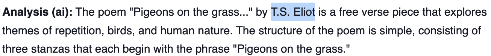
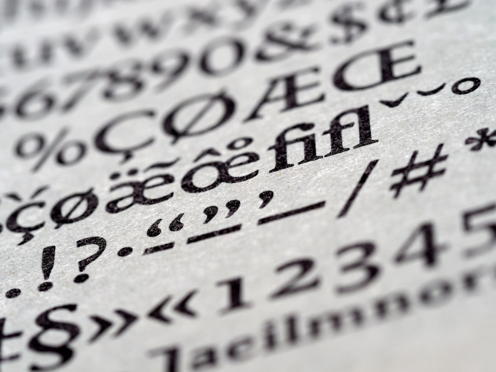

  <a href="https://open.substack.com/pub/swafan/p/em-dashes-on-your-screen-alas?r=1lah8p&utm_campaign=post&utm_medium=web" target="_blank" rel="noopener noreferrer" class="writing-md-external-btn">read on substack</a>

Strictly—that’s right—strictly no—nilch, nada, never, ever, ever, never—em-dashes—“—.”

Colons are not a good substitution: especially in cases where you’d want to put two em-dashes outside a parenthetical clause: like in this example.

It’s not just em-dashes, it’s everything. That’s another cliché: “it’s not just *X*, but *Y*.” This one you see on LinkedIn.

My writing keeps—meaning, all the time—getting flagged as AI.

Briefly, I considered intentional speling mistakes—or even grammar mistakes—to stop gets flagged.

That strikes me as a distinctly Saussurian enterprise. That is, my writing is human because it is not-containing-“—,” or that it is not-free-of-grammar-mistakes. I snuck in another trick there actually. I didn’t say: “it is not just *not*-containing-‘—.’ It is not just *not*-free-of-grammar-mistakes. It’s *not*-AI.”

Also maybe an ancient Hegelian enterprise—positioning your writing as not-AI. As if it were an antithesis of it.

I read relatively recently that certain AI safety features can be circumvented with poetry.

>Em-dashes on your screen alas. 
Em-dashes on your screen alas. 
Shorter longer dashes short longer longer shorter digital screen. Dashes em-dashes dashes on the shorter digital screen alas em-dashes on your screen. 
If they were not em-dashes what were they. (Hyphens.) 

When I googled the original poem from Gertrude Stein, I get this:

<figure>
  
  <figcaption class="writing-img-caption">Screenshot.
</figcaption>
</figure>

Stupid machines stealing—yes, burglarizing—or better, *eating*——all my *Beloved* em-dashes. (Was I supposed to use two em-dashes there—or one?)

It scares me that there exists, in some possible world, a chat prompt that would generate this whole text. Even if I make up—“mackup“—words. No matter how many wordspressions I mackup, still promptable.

I have also recently heard whispers of faint optimism.

That if our ordinary language (emails, texts, blog posts) is to be taken from us, then creative endeavors will take up center stage. After the Black Death, the Renaissance.

But first of all, that was a period of 100 years. Not sure we’ll outlast Covid for that long.

Secondly, it’s still not quite clear the Renaissance ideals were an “upgrade” over previous structures. In any case, it was still in some senses defined *in-opposition* to the before. Still defined as a not-before. Enlightenment as not-unenlightened. I don’t want creative enterprises to just be defined as just not-AI.

Oh, sorry: creative enterprises are not just not-AI, they’re… I don’t know actually.

The incomparable Lyn Hejinian once wrote, “In the ‘open text’, meanwhile, all the elements of the work are maximally excited; here it is because ideas and things exceed (without deserting) argument that they have taken into the dimension of the work.”

Art that is defined as an opposition is not maximally excited. It’s barely excit-*ing*.

But how does one transcend the form itself—and true to her word, Hejinian does not provide a “closed” solution here. Don’t know. I suspect there’s hope in Habermas, but he’s too dense for me to find answers there.

<figure>
  
  <figcaption class="writing-img-caption">Photo by <a href="https://unsplash.com/@brett_jordan" target="_blank" rel="noopener noreferrer">Brett Jordan</a> on <a href="https://unsplash.com/" target="_blank" rel="noopener noreferrer">Unsplash</a></figcaption>
</figure>