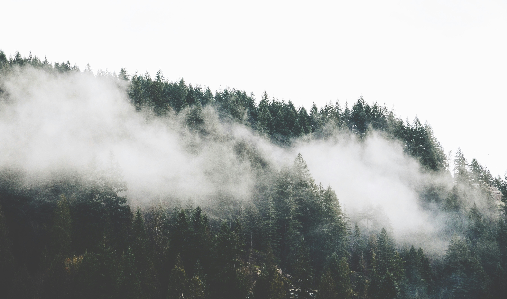

  <a href="https://open.substack.com/pub/swafan/p/down-there-the-smoke?r=1lah8p&utm_campaign=post&utm_medium=web&showWelcomeOnShare=false" target="_blank" rel="noopener noreferrer" class="writing-md-external-btn">read on substack</a>

<!-- replace image, make hyperlinks work -->
<figure>
  
  <figcaption class="writing-img-caption">Photo by <a href="https://unsplash.com/@lauralefurgeysmith?utm_content=creditCopyText&utm_medium=referral&utm_source=unsplash" target="_blank" rel="noopener noreferrer">Marek Bukovan</a> on <a href="https://unsplash.com/" target="_blank" rel="noopener noreferrer">Unsplash</a></figcaption>
</figure>

I’d been sleeping unusually well since I arrived in town. Back home, I’d been waking at odd hours—thin, twitchy sleep—but here, I sank straight down, clean and cold, with no dreams to clutter the descent.

Which made it all the stranger, when, on the fourth day, the pungent smell of burning woke me up. In the kitchen of Mrs. Curtis, who brewed coffee so strong it felt like punishment, I asked if she’d put on incense at night.

Instead, she nodded toward the direction of the empty floodplains out the window. “Down there, the smoke,” she said. “Did you see it?”

I must have stared back at her because she added, “You dream it eventually. Everyone does.”

Mrs. Curtis was a kind if interesting woman. She offered to host me on account of having the only spare room in town. She was in her sixties, maybe, though her face had that ageless quality in certain old portraits: eyes sharp, mouth unreadable. No one called her anything but Mrs. Curtis. I was told that started after her husband struck it rich in the city. He’d died years ago. Now and then I would try to learn her first name. She’d ignore the attempt, or change the subject so deftly I’d forget I’d asked. Even after I left, I never did learn it.

She kept the radio on—always classical, always low, though she refused to learn the titles. “Not knowing keeps it cleaner,” she told me once, as if names could make the music dirty.

But most strange were the comments she started dropping after the first few nights. Phrases dropped like breadcrumbs:

“Don’t go pass the moss after dusk.” “Keep the windows open before bed.” “You’ll know when it’s time.”

Not warnings, just advice, like telling someone to pack a raincoat.

It wasn’t just her. By the end of the week, I spoke with fishermen, retirees, teenage lovers looking for quiet—they all said similar things. “Have you seen it yet, the smoke?” “You’ll understand when you see it.”

I hadn’t come to study the smoke, of course. I hadn’t even known it existed. I was sent to study the town. The bureau needed an account of why a place with fewer than three hundred residents had pushed back so hard against a proposed rail line. The route would pass just outside the town—across flat, unused land—and yet every resident had pooled money to lobby us.

The amount wasn’t much. Certainly not enough to change anything, but it was enough to raise eyebrows. *Cultural resistance*, someone had scribbled in the memo margin. So I was sent in.

I’ll admit, I hadn’t wanted the assignment. I imagined a landscape of absence: long fields, closed shops, blank days. But I took the role anyway, on stipulation that it would be a quick and easy job. Log down a few complaints, one or two reports to plannings, and I would be out of here.

I quickly realized how wrong I was. The interviews, though structured to be dutiful and informative, kept excluding any sort of useful information. The townspeople didn’t care much for the bureau’s promises of tourist traffic. Yes, the seabirds were rare, but they said that like they might say “nice weather.” True, but beside the point.

Instead, they offered local gossip. Billy, the one who ran the weekly paper, once said he broke the story of the schoolteacher’s proposal before even the fiancé knew. “Journalistic instinct,” he said, pleased.

Even when I steered things back to the rail line, the answers felt evasive. But not in the way of people hiding something. More like people who didn’t know how to name it.

Words that hover. A hesitation around certain words. A reluctance to say floodplain. Even the mayor—who was by far the most pragmatic person I met—once trailed off mid-sentence while tracing a zoning map. “Of course,” he said, “you’d have to reroute a bit. But it wouldn’t be the worst idea.”

All I got were the cryptic comments they volunteered. “You’ll understand when you see the smoke.”

This was, of course, a problem. The bureau wanted weekly updates. They were expecting obstruction, a collective outcry, something measurable. “Strategic cultural resistance”—whatever that meant. But the town didn’t resist strategically. It just disagreed softly, like grass growing over tracks.

So when I sent my first weekly progress update, I focused on methodology. A substitute for substance.

>Interviews conducted: 20  
Prevailing sentiment: inconclusive  
Risk of concentrated opposition: low  
Key themes: nostalgia, local attachment, limited economic enthusiasm

I spent a few paragraphs describing the demographics of my interviewees, tried to draw conclusions about the strength of their opposition based on their age. Ended the report with a single line under “Summary”:

>No concrete conclusions yet. Tone of resistance is ambient, not articulated.

After a week, the days soon began to settle into routine. Mornings at the bakery with Ellis, who always refused payment and told the same joke about his “charitable arm” being stronger than his baking one. Afternoons in the mayor’s office, where I interviewed residents from ten to four. Evenings split between the two pubs, which took turns opening to avoid “steal business” from one another. Then the upstairs room of Mrs. Curtis.

Oh, and the comments. At first they were sparse. By the time the second week rolled around, they were constant. So I decided to record what was being said.

Not in any formal sense—just a pocket notebook. Blue cover, elastic band, a gift from someone in the office. I began jotting down the phrases, word for word when I could. Sometimes whole conversations. Sometimes just fragments, heard in passing:

You’ll know when it calls.

There’s a part of the air that’s thicker there.

Best not to walk on the moss at night.

We don’t open doors on Wednesdays, you’ll see why.

Don’t go *down there* too late.

There were dozens of them. I didn’t know what I was looking for. A pattern, maybe. A hidden logic. At night I’d flip through the pages, wondering if it was all just a form of boredom. Rural performance art. Or perhaps, more simply, the town was lonely, and loneliness has its own dialect.

But even then, I’d wake up now and then to that smell again—acrid, but faint, like woodsmoke buried under wet stone. Always in the morning, never in the night. No dream attached. Just a heaviness, like something trying to sink back beneath the surface of waking.

I told myself this was natural. We dream what we hear. I once dreamt of a coworker’s ringtone for weeks after she changed it. The mind recycles. Just like how we dream the faces of people we know, not strangers. You spend your days around people talking about smoke, it’s no wonder some scent leaks into your sleep. Doesn’t mean anything. Doesn’t mean you’ve seen it.

Still, when Mrs. Curtis asked, out of nowhere, if I’d "found the opening yet," I didn’t correct her. I said no, not yet, and sipped my coffee. She didn’t follow up. Just gave a slight nod, as if I’d confirmed something she already suspected.

And that was the moment. The bite.

I still didn’t know what I was being offered, or warned against. But I decided to act as though I did.

Just to see what would happen.

And that was when I started learning more.

At first over a pint with Ellis.

“You know, I left once. Here, I mean,” he said.

“Really? What for?”

“It’s kinda embarrassing but… I wanted to open a proper bakery, you know?”

“No I don’t! Yours is proper alright. You make a damn good brioche,” I argued.

“Thank you,” he laughed. “No, I mean like a serious bakery. With those fancy little cakes y’all city folk seem to love.”

“You can make them here. I’ll have them,” I protested.

“But not the rest of ’em. I’ve tried many times. You put a red velvet cake here, it just grows mold on the display shelf.”

“Well, then why come back?”

“Hmm…” He tapped his glass and motioned for another round.

“The thing is,” he said, quieter now, “leaving just makes you aware of the reasons you didn’t before, you know? People always think you leave because you hate a place. Don’t know if this makes any sorta sense, but, I came back because I hated it.”

“Because hating means you care about it?” I tried.

“Sure.” He took another swig of Guinness. “But also because hating it from afar feels worse. From a distance it’s kind of this… annoying itch. Like trying to scratch a part of your back you can’t reach. At least here, you get to scratch it.”

I let that sit for a moment. Pretend I understood.

Then, quieter: “You’ve seen it, right?”

And there it was. The opportunity to sink my teeth in.

I simply nodded, cautiously.

“Well…” he leaned forward slightly, as if embarrassed to go on. “Sometimes I think it’s a bakery. Or I’d *like* to think it’s a bakery.”

I waited.

He shrugged. “Some mornings, early—before sun-up—you’ll catch this smell in the air. Yeast, cinnamon maybe. Or maybe I just want it to be that. You ever notice the smoke? Comes up real slow, like it’s thinking about it.”

He took another sip. “I had a dream once, back when I first came back. I was baking down there. Full kitchen, all warm light. I had an apprentice, too. Or maybe it was just someone I’d lost.”

He stopped, shook his head. “Anyway. Probably says more about me than the place. Maybe I just wanted to believe there was something *useful* happening there.”

There was a silence, comfortable but charged.

“But did you like the city?” I asked, gently.

“Some good, some bad… Business is easier there—no one seems to cares if your madeleines are any good. They just buy it and move on.” Then, with a smile: “You know, I messed up so many batches of madeleines. Wanted to nail it first try. Here, no one bought them, so I never paid any attention. But when I started properly making ’em, they kept burning. Burnt a whole tray once. Thought it was the humidity, so I put a dehumidifier in the pantry.”

“And?”

“Didn’t help at all,” he laughed. “Turns out I was overmixing the eggs. But for a while, I really believed the machine was doing something.”

We both laughed.

“Oh, and what’s not so great about the city,” he continued. “Well, lots of little things. Couldn’t afford the ingredients I liked. Couldn’t get the light right in the kitchen. And also nobody said good morning. Not even the ones who meant well. But what about you? You like it?”

“Living in the city?”

He nodded.

“Well, you’ve been, so you know. Cities are exciting. There’s always something to do. But sometimes it gets quite difficult. Like you’re always being pushed to prove something. There’s always a new kid trying to take your job. And the thing is, I’m starting to think I don’t mind the quiet here. I think I’m just trying to stay still for a bit and enjoy it while I can.”

We sat there for a while, not saying much more. The bar was mostly empty. The bartender—who might’ve been seventeen, maybe twenty-five—was busy drawing something on a napkin.

Outside, someone passed the window dragging a wheelbarrow behind them. It was too dark to see what was inside, but the smell that trailed behind—burnt peat, or maybe not—caught in the air for a second too long.

Ellis eventually paid and stood to go. “Alright then,” he said, putting on his cap. “Gonna head back a bit earlier. I’ll head to the next town over this weekend for some ingredients. Get excited for some madeleines next week.”

I watched him leave, the door’s chime sounding smaller than it should’ve. The rain had lightened into a mist, the kind that hangs in the air instead of falling. I stayed a little longer, nursing the last third of my pint.

There was something in the way Ellis said “next week” that caught me. Not as a promise, not quite. More like a rhythm. Like the way you say “see you later” to someone even when you might not. Something habitual, modest, unguarded. The kind of thing you only notice when you’re not from here.

It struck me, walking back to Mrs. Curtis’ guestroom, how little I was actually recording. Ellis had spoken for nearly an hour, and not a single word of it would make it into a report back to the bureau. There was no checkbox for burnt madeleines, no line item for “smell of yeast before sunrise.”

And yet, my first real clue. “Bakery?” I put in my notebook.

And somehow, I couldn’t shake the feeling that this—this unmeasurable residue—had something to do with whatever was meant by “cultural resistance.”

I decided my best shot was to consult Wilford.

Wilford was the retired mailman. Oldest in town—and I hoped, the wisest. He lived alone, across the river, in the house with the half-faded “ALE” sign. The “S” has long since departed. I figured maybe, just maybe, I could borrow a little of his years.

He insisted on brewing tea before we spoke. The pot hissed. The mug was chipped. He used honey, no milk.

I cut to it.

“Ellis mentioned something… a bakery. Down there.”

Wilford blinked, slow. Then grinned like a jack-o’-lantern.

“Oh sure, that’s because Ellis is tricked by them. That’s how they keep it quiet.”

I paused. “They?”

He looked around dramatically, though the windows were shut and the kettle still steaming. Then leaned in close enough that I could smell the bergamot on his breath.

“The coven.”

He said it with relish. Like the word itself tasted good.

“They’re always there. Behind the doors. Cooking up some potion or another. That’s why there’s smoke,” he whispered.

Before I could speak, he added, “Don’t let them see you.”

Then he took a proud slurp of tea, leaned back, and offered no further detail.

I thanked him and left after a few polite nods. On the way out, he handed me a small jar of something pickled. It smelled like cloves and rain.

Back at Mrs. Curtis’s, I must’ve looked unsettled. She paused her knitting and asked, “You alright?”

I hesitated, then, “I spoke to Wilford.”

She gave a knowing sigh. “Oh, he’s going a bit… peculiar. Don’t hold it against him. He’s been around.”

“He said it was a coven.”

She laughed, a warm, real laugh, chest and belly all in. “He’s been saying that for decades. Thinks it’s an omen.”

“… And, what do you think?”

She studied me a moment. Then: “If you’re asking me that, you’ve already seen it. Maybe you already have your answer.”

“But for me,” she continued, setting down her wool, “I don’t know about all that. But I’ve always found it… inviting.”

“Inviting?”

“Yeah. Just that I always wake up before I get in.”

Days passed like that.

I spoke again with the fishermen, the retirees, the teenagers sneaking out at night—they all knew it. Not as a legend. Not quite a myth. More like… shared recognition. A thing glimpsed in passing, maybe, or dreamed and never spoken aloud.

Smoke. A house. A bakery. Something warm. Something wooden.

My notebook filled with sketches and fragments. A red door. Homely smells. Shutters like blinking eyes. Something buried just under the edge of waking.

I got better at asking. Learned not to press too hard. I’d ask: How long ago do you think it’s been there? Can you touch it? Has it changed lately?

I also learned what not to ask. Things like whether a rail might help business. Why the statue in the park had no plaque. Who kept placing fresh flowers at the war memorial, though no one ever seemed to visit.

By the end of my second week, a shape began to cohere. Down where the rail would cut, people dreamed of a structure. They all pointed to the same patch of mossy ground no one walked across. Same clearing, same air. Same scent of something just-baked and vanishing.

Low-slung. Dug into the earth. White smoke curling out from the chimney, or sometimes hovering inside, like fog.

But when I asked what the house was for, the answers fractured. A bakery. A waiting room. A chapel. A shelter. A memory.

None of the answers matched. And yet everyone agreed it was there.

This was the problem I had to explain in my second report.

I wrote in a section titled “Cultural Resistance”:

>The residents of Site B refer, with surprising consistency, to an unregistered structure located along the projected rail route through the northern floodplain. No official record or aerial imaging confirms any current dwelling there. Site investigation also shows no traces of any structure having been there. Nonetheless, references span ages and demographics.    
Descriptions vary in function but are notably consistent in form. Terms include: bakery, cottage, house, shelter, or—on occasion—“place where the smoke comes from.” Recollections often carry a dreamlike quality. Most speak of it as something long-familiar.    
While unverifiable, these shared accounts suggest a symbolic (if not literal) presence. The structure appears to function as a cultural anchor or subconscious landmark. The metaphorical weight may constitute a form of passive resistance to incoming development.     
Recommending further investigation under cultural heritage clause 7.3.

I read the report again before submitting it.

It was true. Or true-ish. As true as I could be without compromising my own clarity. But as I re-read it, I felt something gnawing. Like I’d reported on a holy place as if it were a traffic circle.

I felt—embarrassingly—sorry. Sorry for the town. Sorry for something I couldn’t quite name.

The bureau’s reply came within the hour.

>Let’s keep it to the facts. Soil quality, permits, topography. Final week on the ground. Full submission due Friday.

So I revised the report. I cut the talk of cultural symbols. I replaced it with a note about rare mineral pockets affecting drainage. I typed, *Recommend minor reroute pending soil survey*—a lie I hoped would slow them down.

But even then, the email came back almost-immediately.

Short. Clinical.

>Final push. Stick to plan.

The next morning, I woke up to after another deep, gentle, dreamless sleep. But I swore I smelt firewood in my breath, like I’d been standing too close to something burning all night.

That afternoon, I helped Ellis chop wood behind his shed. We barely spoke, but the silence was companionable. After a while, he brought out two chipped enamel mugs filled with something cold and lemony, and we sat on overturned buckets, watching the river slide by, thick and slow and brown.

“You know,” he said, finally, “I always thought no one else saw it. The little house down there.”

I looked at him. “But you still talked about it.”

He nodded. “Figured it was just a dream that stuck around too long. Some things do. But lately I’ve been thinking… maybe it’s not about whether it’s real. Maybe it’s real because we’ve all agreed not to look too close.”

I didn’t answer. We both watched a heron skim the water, wings wide and quiet as regret.

That evening, Mrs. Curtis knocked on my door with a warm peach cobbler, wrapped in a checkered cloth. She said I looked thinner, though I hadn’t noticed. I invited her in and she sat while I made us tea, and we shared the cobbler with two forks straight from the dish.

I asked if she’d ever tried to go into the house.

She smiled faintly. “Once. Years ago, after my husband… I had a dream I found the front door and knocked.”

“And?”

“It opened. But I couldn’t step inside. There were people sitting around a table. Quiet, like they were waiting for something. But the chairs were already full.”

“Full of witches?” I laughed.

She gave a half-hearted laugh and looked out the window. “I couldn’t remember their faces, but it was certainly not that. I just remember the smell—like rain on cedar. Like something old and safe.”

The room was quiet for a while. The smell of cinnamon lingered in the air. For the first time in days, I felt the ache of what I already knew I’d miss.

The next morning, I took a long walk by the remains of the ferry pier—bare posts in the mud, wrapped in riverweed. That’s when the boy found me. Ten or eleven, freckled, with a wiry kind of seriousness. He walked right up like he’d been sent on a mission.

“You’re the man asking questions, right?”

I nodded. “I suppose I am.”

He didn’t offer a name, just pulled a sketchpad from under his arm and flipped it open. The drawing was careful, practiced. A house low to the ground, almost sunken, with a slanted roof. Smoke rose in soft coils from a crooked chimney, curling like question marks into the page’s margin.

“I see it all the time,” he said. “Even when I’m not asleep.”

“It’s beautiful,” I said. “Where is it?”

He pointed out past the pier, to the floodplain where the ground dipped and shimmered in the heat.

“Right there. But only if you don’t try too hard.”

“How do you mean?”

“If you look too hard, you’ll miss it.”

I crouched beside him. “What do you think it is?”

He considered. “A place where everyone who ever left comes back to rest.”

I swallowed. “And how do you know that?”

He shrugged. “Cause papa waved through the window.”

I took a deep breath.

He continued, “but you can’t live there. You can only visit. That’s the rule.”

“The rule?”

He nodded. “It’s not written down. You just feel it. Like when you know you’re not supposed to wake up yet.”

I didn’t know what to say to that. Not really.

So I just said thank you.

The boy smiled, then turned and walked back the way he’d come, sketchpad under one arm, dust rising behind his sneakers.

The day before I was due to leave, I decided I should make an effort to revisit the grounds. Not the maps or municipal files—just the place itself. I packed a thermos, slipped my notebook into my coat pocket, and headed out early, while the town was still wiping the sleep from its windows.

It was a cold morning. Not the kind of cold that drizzled from the sky, but the sort that seemed to rise up from the ground, seep through and settle in the linings of your coat. Mist pooled low across the grass, not quite fog—fog rolls in, makes a spectacle of itself. This was more quiet. Clinging. It hung in my hair and along the cuffs of my sleeves.

The walk to the site took me past the shuttered laundromat, the old co-op building with its collapsing notice board, Wilford’s old building, Ellis’ worn-down shed, and then out toward the thicket where the trees start to grow funny. The trees in this part of town were dark. Charcoal figures against the white. Like watercolor left out in the rain.

There was nothing dramatic to see. No fences, no signs, no sudden drop. Just a dirt path, trees, and wet. The birds hadn’t started yet. Even the wind felt tentative.

According to the site maps, the house—the one from the dreams—would’ve stood on a gentle rise, twenty-minutes away from the central square, where the land swells slightly before dipping again toward the river.

By the time I got there, the first rays of sun has begun threading through the mist. Still hesitant, but the taller trees have begun taking on color. It was the exact same as when I saw it the first day I arrived. A loose arrangement of pine and ferns, and beneath my boots, the grass gave way to a spongier kind of moss.

The moss made a quiet squish underfoot, like something breathing just beneath the surface. I stood still for a while. And just looked. Not because there was anything to look at—there wasn’t—but because it felt wrong to move too quickly during this time of day. Like disturbing something you’re not supposed to touch.

The space was ordinary. Or at least, it looked ordinary. A modest swell in the land. The kind of rise you’d barely notice if you weren’t looking for it. A clearing not quite clear. But if I tried—if I let my eyes soften the way they do just before sleep—I could understand the appeal of a porch here. Low slung. Wooden. The kind that creaks on each step.

Maybe there would’ve been a swing. Or an old rocking chair with a crooked leg, left to sway with the breeze in front of the faded brick.

The windows were tall. Narrow. And I don’t know why I thought this, but I imagined they would be slightly open, as if someone had left them that way out of habit as the morning mist seeps in like a lullaby.

A chimney, too. Not smoking, but present. A lone figure in the mist. Like the trees.

I walked a slow circle around the clearing, half-measuring, half-tracing. I wanted to see what it felt like to move through the space where the house would have been. I paused where I imagined the door might go. Stood where the kitchen could have been. Where would the sink face? Would it look toward the tracks? Or away?

I looked down at my hands, half-expecting them to be wet. They weren’t. Just cold. I reached for my notebook and scribbled half a sentence about how soft the moss felt. *Moss quality potentially problematic for*… before I stopped.

Instead, I walked a slow circle around the clearing and sat down in the grass and began to draw.

That night, I found myself at the smaller of the two pubs—the one tucked behind the post office, with no sign and only three taps. Ellis was there, nursing something dark in a short glass. He nodded when I walked in, and I joined him.

“Thought you might be gone already,” he said.

“Tomorrow.”

He gestured for two more drinks. The barman poured them without asking what we wanted.

We sat in a comfortable quiet for a while, the kind you can only share with someone who doesn’t expect you to fill it.

“I went to the site today,” I said eventually.

Ellis didn’t look over. “And?”

“I don’t know. There’s nothing there. Just a rise in the land. Moss. Trees.”

He took a slow sip. “Sounds about right.”

I turned the glass in my hands. “I’m not sure what to tell them. The bureau. The agency.”

“You mean the report?”

I nodded.

Ellis gave a soft grunt, a sound that could mean anything.

“They want facts,” I said, looking into my glass. “Topography. Soil samples. They don’t want to hear about a…” I paused. I didn’t want to say a house that isn’t there. “They don’t want to hear about *down there*.”

He finally looked at me, a direct, clear gaze. “No. I reckon they don’t.” He took a slow swig of his drink. “But you saw it, didn’t you? The way the light sits. The way the air just sort of hangs.”

I thought of the drawing the boy had given me, the smoke coiling from the chimney like a question. I thought of Mrs. Curtis's inviting smile, and Wilford's coven. I thought about how the moss felt this morning. "I felt... something."

“Tell them that, then,” he said, not unkindly. “Tell them how it feels. How we feel. What you felt.”

I gave a bitter laugh.

“Tell them that it’s already… occupied.” He gestured vaguely with his hand, encompassing the air around us, the pub, the town outside.

*Yes, occupied. There was already something here.*

I considered this, the warmth of the pub, the lower murmur of rain outside. “They’ll just laugh me out the office.”

“Maybe.” He drained his glass. “But maybe that’s not the point.”

He stood and stretched, nodding to the barman.

As he moved to leave, he turned back once.

“Will you miss it?”

“Here?”

“Yea.”

“Yea, I think I’ll miss the town.”

“The town will miss you too.”

Then he left me alone with my drink.

I thought to myself: *how strange, if a place can miss a person.*

When I finally returned to my room, I pulled my notebook from my coat, and began to flip through the pages. Scraps of impressions. A few measurements. Half a dozen quotations in messy shorthand.

Interviews. Observations. Impressions. Not evidence, maybe. But feeling.

And I began to write:

>**DRAFT REPORT – Field Notes: Parcel 17-A, Lower Floodplain Region**  
*(Internal use only. Not yet submitted.)*  
No permanent structures observed on-site.  
Elevation variance: minimal.  
Soil saturation: moderate to high.  
Moss species unusually dense—may suggest irregular drainage or mineral retention.  
Recommended action: pause survey and reconsider site integrity from local-use perspective.

*But then again,  what does that mean, local-use perspective?*

They kept saying the same thing, these people.

>“It wouldn’t feel right, putting something there. It’s not a grave, but it’s not… empty either.”  
—Iris L., restaurant owner

Something in the tone, the way they said it. Like they were describing a shared living room. Not mystical. Just familiar.

>“We used to bike out that way in the summers. You’d cool your wrists in the stream and lie on the moss like it was a mattress.”  
—Curtis, retired    
“My daughter sketched that same house when she was six. Told me it was from a dream. Never mentioned it again.”  
—Virginia W., clerk

No official records of past dwellings, nor significant archaeological activity.

No wartime trench lines.

No registered graves.

Still,

>30 interviewees described the same thing:
>* A house with a slanted roof
>* A chimney with smoke
>* A porch that creaked
>* Light behind tall windows

That had to mean something… right?

>“It’s the kind of place you wake up from and feel better, even if nothing happened in the dream.”  
—Benjamin G., fisherman

And later,

>Possible explanations:  
Shared memory artifact? Regional dream-symbol bleed?  
(Still looking into that. Cross-reference: folklore/collective unconscious?)

I secretly think to myself: Or maybe it's just the quiet. Maybe some land holds stillness in a way that reminds people of home.

>**Preliminary Recommendation:**  
Suspend approval for permanent development pending further study. Not due to geological risks, but due to perceived **communal value**.

I don’t know how to measure any of this.

But I know what it felt like, walking the grounds that morning.

The hush. The moss breathing back at me.

I stood where the door might have been.

And for just a moment, I felt like I was trespassing.

And finally, after a long think, I added one more line:

>*Note: this is not sentiment. It's something deeper—something structural. The land already holds something. No less real for being unbuilt.*

---

Back in the city, everything felt louder. Phones rang more sharply. The lights above my desk buzzed in a way I hadn’t noticed before.

The report was quickly dismissed—“overly sentimental,” someone muttered in the margins.

There was a brief moment during Monday's meeting when I thought someone might take it seriously. But then Randolph made a joke about dream zoning and the room laughed. That was that.

I started sleeping poorly again. Restless, thin sleep—the old kind. I’d lie still for hours, trying not to remember the smell of the moss.

The update came through on Friday. Greenlit.

Excavators would begin Monday.

And the night before the excavators would go in,  
a house. A swing. The gentle smell of firewood drifting from the chimney.
